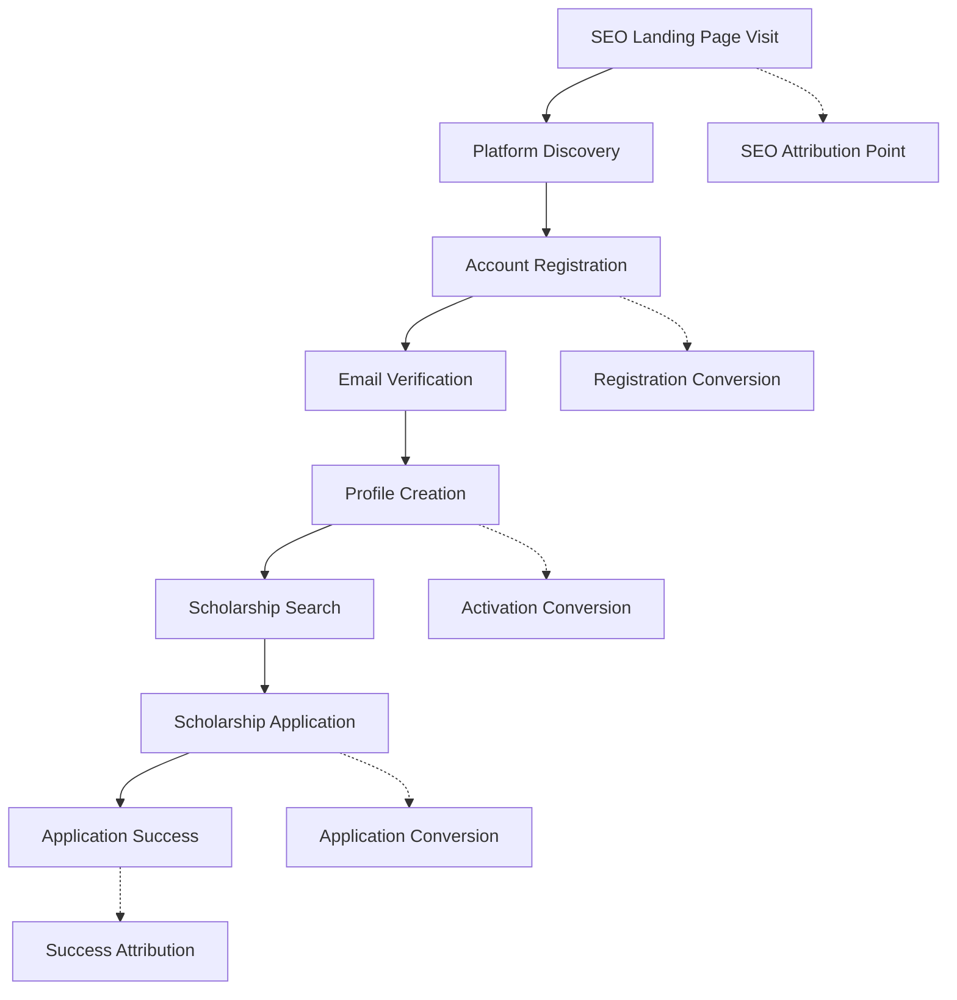
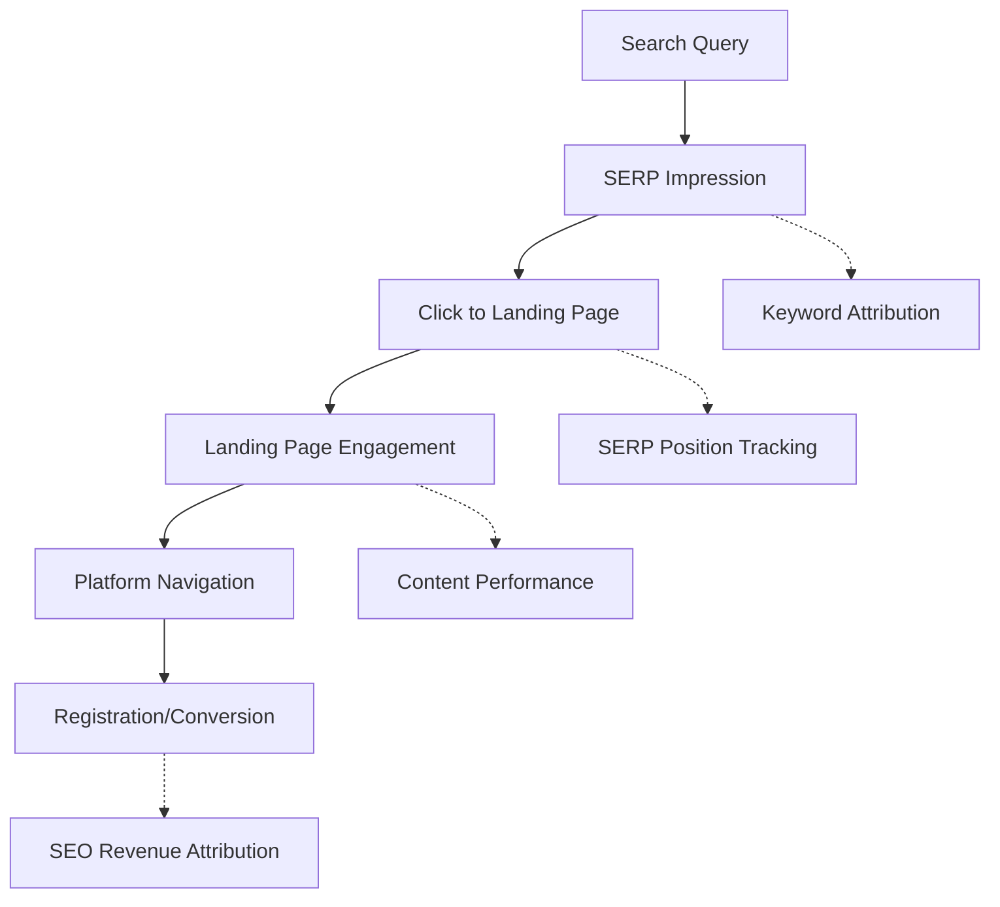

# KPI Telemetry & Analytics Plan
**Platform:** ScholarMatch Platform with Auto Page Maker SEO Engine  
**Planning Date:** September 26, 2025  
**Scope:** B2C/B2B Conversion Tracking, SEO Attribution, Growth Analytics  
**Implementation Phase:** Planning (Phase 1 of QA Audit)

---

## EXECUTIVE SUMMARY

**Objective:** Design comprehensive telemetry strategy for tracking ScholarMatch platform success across user acquisition, engagement, conversion, and SEO performance. Focus on attribution-driven growth measurement with privacy-compliant data collection.

**Current State:** Basic performance metrics collection implemented, Google Analytics configured (optional), no conversion tracking implemented yet.

**Target State:** Full-funnel analytics with SEO attribution, conversion tracking, and automated performance monitoring for B2C student acquisition and B2B partnership development.

---

## BUSINESS OBJECTIVES & SUCCESS METRICS

### **Primary Business Goals** 🎯

#### **B2C Student Acquisition** (Primary Revenue Driver)
- **Student Registration Rate:** % of visitors who create accounts
- **Profile Completion Rate:** % of registered students who complete profiles
- **Scholarship Application Rate:** % of students who apply to scholarships through platform
- **Student Lifetime Value (LTV):** Revenue generated per student over lifetime
- **Student Retention Rate:** % of students who return monthly

#### **SEO & Content Performance** (Growth Engine)
- **Organic Traffic Volume:** Monthly unique visitors from search engines
- **Landing Page Conversion Rate:** % of landing page visitors who register
- **SEO Attribution Revenue:** Revenue attributed to organic search sources
- **Content Engagement:** Time on page, bounce rate, social shares
- **Search Ranking Performance:** Target keyword position tracking

#### **B2B Partnership Development** (Future Revenue Stream)
- **School Partnership Inquiries:** Educational institution contact rate
- **Enterprise Demo Requests:** % of B2B visitors requesting demos
- **Partnership Conversion Rate:** % of inquiries converting to partnerships
- **B2B Pipeline Value:** Total value of B2B opportunities in pipeline

---

## CONVERSION FUNNEL ARCHITECTURE

### **B2C Student Journey Funnel** 📊



#### **Conversion Tracking Points**
1. **Discovery to Registration:** Landing page → signup conversion
2. **Registration to Activation:** Account creation → profile completion  
3. **Activation to Engagement:** Profile completion → scholarship search
4. **Engagement to Conversion:** Search → scholarship application
5. **Conversion to Success:** Application → scholarship award (future tracking)

### **SEO Attribution Funnel** 🔍



---

## KEY PERFORMANCE INDICATORS (KPIs)

### **Tier 1: Business-Critical KPIs** 🔴

#### **Revenue & Growth Metrics**
| KPI | Target | Measurement | Priority |
|-----|---------|-------------|----------|
| Monthly Active Students | 10,000 | User activity tracking | Critical |
| Student Registration Rate | 15% | Landing page conversions | Critical |
| Scholarship Application Rate | 40% | Profile → application funnel | Critical |
| SEO Organic Traffic Growth | +25% MoM | Google Analytics + Search Console | Critical |
| Landing Page Conversion Rate | 8% | Auto Page Maker performance | Critical |

#### **Platform Health Metrics**
| KPI | Target | Measurement | Priority |
|-----|---------|-------------|----------|
| Site Performance Score | >90 | Core Web Vitals | Critical |
| Search Ranking (Target Keywords) | Top 3 positions | SEO tracking tools | Critical |
| User Session Duration | 5+ minutes | Engagement analytics | High |
| Bounce Rate | <40% | Analytics platforms | High |

### **Tier 2: Operational KPIs** 🟡

#### **Content & SEO Performance**
| KPI | Target | Measurement | Priority |
|-----|---------|-------------|----------|
| Landing Pages Generated | 500+/month | Auto Page Maker metrics | High |
| Content Crawlability Score | 95%+ | SEO testing tools | High |
| Page Load Speed (LCP) | <2.5s | Core Web Vitals | High |
| Social Sharing Rate | 5%+ | Content engagement | Medium |

#### **User Experience Metrics**
| KPI | Target | Measurement | Priority |
|-----|---------|-------------|----------|
| Profile Completion Rate | 80% | User journey tracking | High |
| Search Success Rate | 85% | Scholarship discovery | High |
| Feature Adoption Rate | 60% | Platform feature usage | Medium |
| Help/Support Contact Rate | <5% | Customer service | Medium |

### **Tier 3: Leading Indicators** 🟢

#### **Early Warning Metrics**
| KPI | Target | Measurement | Priority |
|-----|---------|-------------|----------|
| Daily Active Users | 1,500 | Daily engagement | Medium |
| Email Open Rate | 25%+ | Email campaigns | Medium |
| Social Media Mentions | 100/month | Brand monitoring | Low |
| API Response Time | <200ms | System performance | Medium |

---

## ANALYTICS IMPLEMENTATION STRATEGY

### **Primary Analytics Stack** 📈

#### **Google Analytics 4** (Currently Optional)
```javascript
// GA4 Configuration for Enhanced Ecommerce
gtag('config', 'G-MEASUREMENT_ID', {
  // Enhanced Ecommerce for Scholarship Applications
  send_page_view: true,
  custom_map: {
    'custom_parameter_1': 'scholarship_id',
    'custom_parameter_2': 'user_education_level'
  }
});

// Custom Event Tracking
gtag('event', 'scholarship_application', {
  event_category: 'conversion',
  scholarship_id: scholarshipId,
  scholarship_value: amount,
  user_education_level: level
});
```

#### **Server-Side Analytics** (Custom Implementation)
```javascript
// Internal Analytics Service
class AnalyticsService {
  trackConversion(event) {
    // Track to internal database
    await db.insert(analyticsEvents).values({
      userId: event.userId,
      eventType: event.type,
      value: event.value,
      attribution: event.source,
      timestamp: new Date()
    });
    
    // Send to external analytics
    await this.sendToGA4(event);
  }
}
```

### **SEO Attribution Tracking** 🔍

#### **UTM Parameter Strategy**
```
Organic Search: utm_source=google&utm_medium=organic&utm_campaign=seo
Landing Pages: utm_source=google&utm_medium=organic&utm_campaign=landing_page_{template}
Direct Type-in: utm_source=direct&utm_medium=none&utm_campaign=direct
```

#### **Search Console Integration**
```javascript
// Search Performance Tracking
const searchConsoleData = {
  query: searchQuery,
  position: averagePosition,
  impressions: impressionCount,
  clicks: clickCount,
  ctr: clickThroughRate
};

// Attribution to Conversions
const seoAttribution = {
  searchQuery: query,
  landingPage: pageUrl,
  conversionValue: scholarshipApplicationValue,
  timeToConversion: timeSpent
};
```

### **Conversion Attribution Model** 📊

#### **Multi-Touch Attribution**
```javascript
const attributionModel = {
  firstTouch: {
    weight: 0.40, // First discovery gets 40%
    source: initialReferrer
  },
  lastTouch: {
    weight: 0.40, // Final conversion gets 40% 
    source: conversionReferrer
  },
  assistingTouches: {
    weight: 0.20, // Middle touches split 20%
    sources: assistingReferrers
  }
};
```

---

## DATA COLLECTION ARCHITECTURE

### **Client-Side Tracking** 🖥️

#### **Performance Metrics Collection**
```javascript
// Core Web Vitals Tracking (Already Implemented)
const performanceMetrics = {
  lcp: largestContentfulPaint,
  ttfb: timeToFirstByte, 
  cls: cumulativeLayoutShift,
  fid: firstInputDelay
};

// Enhanced User Journey Tracking
const userJourney = {
  sessionId: generateSessionId(),
  pageViews: [],
  interactions: [],
  conversionEvents: [],
  attributionData: getAttributionData()
};
```

#### **Privacy-Compliant Data Collection**
```javascript
// Consent-Based Tracking
if (userConsent.analytics) {
  trackEvent('page_view', {
    page: currentPage,
    referrer: document.referrer,
    timestamp: Date.now()
  });
}

// Cookieless Tracking Options
const fingerprint = generateUserFingerprint({
  screen: screen.width + 'x' + screen.height,
  timezone: Intl.DateTimeFormat().resolvedOptions().timeZone,
  language: navigator.language
});
```

### **Server-Side Analytics** 🖧

#### **Event Tracking Schema**
```sql
-- Analytics Events Table
CREATE TABLE analytics_events (
  id UUID PRIMARY KEY DEFAULT gen_random_uuid(),
  session_id VARCHAR NOT NULL,
  user_id UUID REFERENCES users(id),
  event_type VARCHAR NOT NULL, -- page_view, conversion, etc.
  event_data JSONB NOT NULL,
  attribution_data JSONB,
  timestamp TIMESTAMP DEFAULT NOW(),
  ip_address INET,
  user_agent TEXT
);

-- SEO Attribution Table  
CREATE TABLE seo_attribution (
  id UUID PRIMARY KEY DEFAULT gen_random_uuid(),
  conversion_id UUID REFERENCES analytics_events(id),
  search_query VARCHAR,
  landing_page VARCHAR NOT NULL,
  search_position INTEGER,
  attribution_value DECIMAL(10,2),
  timestamp TIMESTAMP DEFAULT NOW()
);
```

---

## AUTOMATED REPORTING & DASHBOARDS

### **Real-Time Dashboard Requirements** 📊

#### **Executive Dashboard** (Daily Updates)
```yaml
Metrics Displayed:
  - Daily Active Users (current vs. target)
  - Registration Conversions (today vs. yesterday)
  - SEO Traffic Volume (current vs. previous period)
  - Top Performing Landing Pages
  - Revenue Attribution by Source

Alerts Configured:
  - Conversion rate drop >20%
  - Site performance degradation  
  - SEO ranking drops
  - Traffic anomalies
```

#### **SEO Performance Dashboard** (Weekly Updates)
```yaml
Metrics Displayed:
  - Keyword ranking positions
  - Landing page performance
  - Core Web Vitals scores
  - Crawlability issues
  - Content generation performance

Reports Generated:
  - Weekly SEO performance summary
  - Landing page effectiveness report
  - Content opportunity analysis
  - Technical SEO health check
```

### **Automated Alert System** 🚨

#### **Performance Alerts**
```javascript
const performanceAlerts = {
  corWebVitals: {
    lcp: { threshold: 2500, alert: 'email' },
    ttfb: { threshold: 600, alert: 'slack' },
    cls: { threshold: 0.1, alert: 'email' }
  },
  conversionRates: {
    registration: { threshold: 0.12, alert: 'email' },
    application: { threshold: 0.35, alert: 'slack' }
  }
};
```

#### **Growth Monitoring Alerts**
```javascript
const growthAlerts = {
  trafficDrops: {
    organicTraffic: { threshold: -15, period: 'week', alert: 'email' },
    directTraffic: { threshold: -25, period: 'week', alert: 'slack' }
  },
  conversionDrops: {
    registrations: { threshold: -20, period: 'day', alert: 'email' },
    applications: { threshold: -15, period: 'day', alert: 'email' }
  }
};
```

---

## PRIVACY & COMPLIANCE CONSIDERATIONS

### **Data Collection Compliance** 🔒

#### **GDPR/CCPA Requirements**
- **Consent Management:** Granular consent for analytics tracking
- **Data Minimization:** Collect only necessary performance data
- **Right to Erasure:** User data deletion from analytics
- **Data Portability:** Export user analytics data on request

#### **FERPA/COPPA Considerations**
- **Student Privacy:** Enhanced protection for educational record analytics
- **Parental Consent:** Required for under-13 analytics tracking
- **Data Anonymization:** Remove PII from analytics data
- **Educational Purpose:** Ensure analytics serve educational goals

### **Technical Privacy Measures** 🛡️

#### **Data Anonymization Pipeline**
```javascript
// PII Removal for Analytics
const anonymizeUserData = (userData) => {
  return {
    userId: hashUserId(userData.id), // One-way hash
    educationLevel: userData.level,
    registrationDate: userData.created,
    // Remove: email, name, specific school info
  };
};

// IP Address Anonymization  
const anonymizeIP = (ipAddress) => {
  return ipAddress.replace(/\.\d+$/, '.0'); // Remove last octet
};
```

---

## IMPLEMENTATION ROADMAP

### **Phase 1: Foundation (Current - Week 4)** 🏗️
- [x] Basic performance metrics collection
- [x] Google Analytics 4 configuration (optional)
- [ ] Server-side analytics event tracking
- [ ] Database schema for analytics storage
- [ ] Privacy-compliant data collection

### **Phase 2: Conversion Tracking (Week 5-8)** 📈
- [ ] Multi-step funnel tracking implementation
- [ ] SEO attribution model development  
- [ ] A/B testing framework for landing pages
- [ ] Conversion goal configuration
- [ ] Revenue attribution tracking

### **Phase 3: Advanced Analytics (Week 9-12)** 🚀
- [ ] Real-time dashboard development
- [ ] Automated alert system implementation
- [ ] Advanced segmentation and cohort analysis
- [ ] Predictive analytics for user behavior
- [ ] Machine learning-based optimization

### **Phase 4: Optimization & Scale (Week 13-16)** 🎯
- [ ] Advanced attribution modeling
- [ ] Cross-platform tracking integration
- [ ] Enterprise reporting capabilities
- [ ] API for third-party analytics integration
- [ ] Advanced privacy controls and user preferences

---

## TECHNICAL IMPLEMENTATION DETAILS

### **Analytics Service Architecture** 🏗️

#### **Event Collection Service**
```typescript
interface AnalyticsEvent {
  eventId: string;
  sessionId: string;
  userId?: string;
  eventType: 'page_view' | 'conversion' | 'interaction';
  eventData: Record<string, any>;
  attribution: AttributionData;
  timestamp: Date;
  privacy: PrivacySettings;
}

class AnalyticsCollector {
  async trackEvent(event: AnalyticsEvent) {
    // Validate privacy consent
    if (!this.hasConsent(event.privacy)) return;
    
    // Anonymize if required
    const sanitizedEvent = this.sanitizeEvent(event);
    
    // Store locally
    await this.storeEvent(sanitizedEvent);
    
    // Send to external services
    await this.forwardEvent(sanitizedEvent);
  }
}
```

#### **Attribution Engine**
```typescript
class AttributionEngine {
  calculateAttribution(conversionEvent: AnalyticsEvent) {
    const userJourney = this.getUserJourney(conversionEvent.userId);
    
    return {
      firstTouch: userJourney.touchpoints[0],
      lastTouch: userJourney.touchpoints[userJourney.length - 1],
      assistingTouches: userJourney.touchpoints.slice(1, -1),
      attributionWeights: this.calculateWeights(userJourney)
    };
  }
}
```

### **Performance Monitoring** 📊

#### **Core Web Vitals Integration**
```javascript
// Enhanced Performance Monitoring (extends current implementation)
class PerformanceMonitor {
  collectCoreWebVitals() {
    // Extends existing implementation in client/src/hooks/usePerformanceMetrics.ts
    return {
      lcp: this.getLargestContentfulPaint(),
      ttfb: this.getTimeToFirstByte(),
      cls: this.getCumulativeLayoutShift(),
      // Add custom metrics
      pageInteractivity: this.getPageInteractivityScore(),
      resourceLoadTime: this.getResourceLoadMetrics(),
      renderingPerformance: this.getRenderingMetrics()
    };
  }
}
```

---

## SUCCESS MEASUREMENT FRAMEWORK

### **OKR (Objectives & Key Results) Integration** 🎯

#### **Q1 2026 Example OKRs**
**Objective:** Achieve sustainable growth through SEO-driven student acquisition

**Key Results:**
- KR1: Increase monthly organic traffic by 50% (baseline: current traffic)
- KR2: Achieve 12% registration conversion rate from SEO traffic  
- KR3: Generate 100+ scholarship applications monthly from organic search
- KR4: Maintain >90 Core Web Vitals score across all landing pages

#### **Measurement Cadence**
- **Daily:** Core metrics monitoring and alert management
- **Weekly:** Conversion funnel analysis and SEO performance review
- **Monthly:** Comprehensive business review and optimization planning
- **Quarterly:** Strategic analytics review and roadmap planning

### **A/B Testing Framework** 🧪

#### **Landing Page Optimization Tests**
```javascript
const landingPageTests = {
  headlines: {
    control: "Find Scholarships for Your Future",
    variant: "Discover $50,000+ in Scholarship Opportunities"
  },
  cta_buttons: {
    control: "Get Started",
    variant: "Find My Scholarships"
  },
  layouts: {
    control: "traditional_form",
    variant: "progressive_disclosure"
  }
};
```

---

## COMPETITIVE ANALYTICS & BENCHMARKING

### **Industry Benchmark Targets** 📊

#### **EdTech Platform Benchmarks**
| Metric | Industry Average | Our Target | Current Status |
|--------|------------------|------------|----------------|
| Registration Conversion | 8-12% | 15% | To be measured |
| User Engagement Rate | 35% | 45% | To be measured |
| Organic Traffic Share | 40% | 60% | To be measured |
| Page Load Speed | 3.2s | <2.5s | Currently optimized |

#### **SEO Performance Benchmarks**
| Metric | Education Sector | Our Target | Current Status |
|--------|-----------------|------------|----------------|
| Organic CTR | 3.17% | 5% | To be measured |
| Average Session Duration | 2:45 | 5:00 | To be measured |
| Pages per Session | 2.1 | 3.5 | To be measured |
| Bounce Rate | 55% | <40% | To be measured |

---

## CONCLUSION & NEXT STEPS

### **Implementation Priority Matrix** 📋

#### **High Impact, Low Effort** (Immediate Implementation)
1. **Server-side analytics event tracking** - Foundation for all other metrics
2. **Conversion funnel setup** - Essential for measuring success  
3. **Basic SEO attribution** - Critical for growth measurement
4. **Performance alerts** - Prevent degradation of user experience

#### **High Impact, High Effort** (3-6 month timeline)
1. **Advanced attribution modeling** - Multi-touch attribution
2. **Real-time dashboard system** - Executive and operational visibility
3. **Predictive analytics** - User behavior prediction and optimization
4. **Cross-platform integration** - Comprehensive user journey tracking

#### **Medium Impact, Low Effort** (Fill-in implementation)
1. **Social media tracking** - Brand awareness and engagement
2. **Email campaign analytics** - Marketing effectiveness measurement
3. **Content performance metrics** - SEO content optimization
4. **Competitive intelligence** - Market position tracking

### **Resource Requirements** 💼
- **Development Time:** 4-6 weeks for Phase 1 implementation
- **Ongoing Maintenance:** 2-4 hours/week for monitoring and optimization
- **Tool Costs:** Google Analytics (free), additional tools ~$200-500/month
- **Compliance Review:** Legal and privacy team consultation required

**Next Phase:** Upon Phase 1 QA approval, proceed with analytics implementation alongside Phase 2 functional testing.

---

**Plan Version:** 1.0  
**Plan Date:** September 26, 2025  
**Implementation Start:** Upon Phase 1 QA Gate Approval  
**Expected Completion:** 16 weeks from start